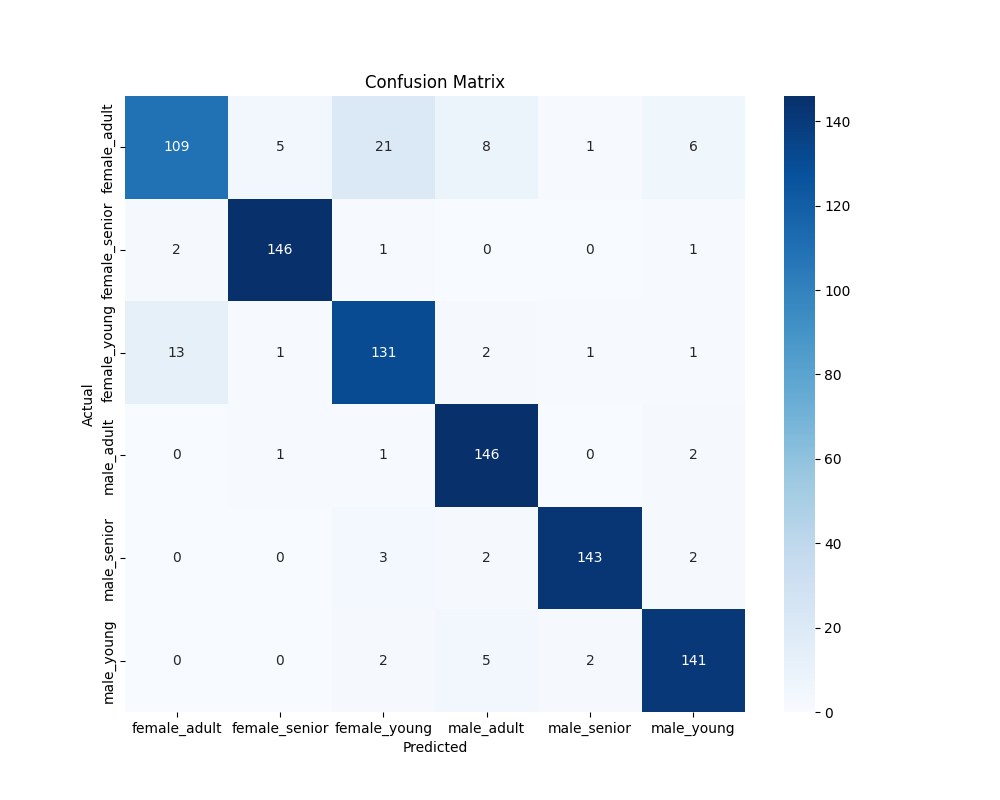

### Clasificación usando Red Neuronal

Para la clasificación de las grabaciones de voz, se diseñó e implementó una Red Neuronal Multicapa (MLP) profunda, aprovechando su capacidad para aprender representaciones jerárquicas y capturar patrones complejos en los datos. La arquitectura del modelo fue diseñada para maximizar el rendimiento predictivo, incorporando capas densas, regularización y optimización avanzada.

**Arquitectura del Modelo**

La red neuronal se construyó con una estructura secuencial, compuesta por las siguientes capas:

1.  **Capa de Entrada:** La primera capa densa recibe los 43 atributos acústicos extraídos de cada clip de audio.
2.  **Capas Ocultas:** El núcleo del modelo consta de tres capas ocultas, cada una siguiendo un patrón de `Bloque Neuronal` para optimizar el aprendizaje y la generalización:
    *   **Primera Capa Oculta:** 256 neuronas
    *   **Segunda Capa Oculta:** 128 neuronas
    *   **Tercera Capa Oculta:** 64 neuronas
3.  **Capa de Salida:** La capa final utiliza una función de activación `Softmax` con 6 neuronas, una por cada clase objetivo (combinación de género y grupo etario), para producir una distribución de probabilidad sobre las posibles categorías.

Cada `Bloque Neuronal` está compuesto por:

*   **Capa Densa:** Utiliza la función de activación `ReLU` y el inicializador de pesos `He Normal` para mitigar el problema de desvanecimiento del gradiente.
*   **Batch Normalization:** Normaliza las activaciones de la capa anterior para acelerar el entrenamiento y mejorar la estabilidad del modelo.
*   **Dropout (25%):** Técnica de regularización que desactiva aleatoriamente el 25% de las neuronas durante el entrenamiento para prevenir el sobreajuste.

**Entrenamiento y Optimización**

El modelo fue entrenado utilizando el optimizador `Adam`, con una tasa de aprendizaje inicial de `0.001`. Para asegurar un entrenamiento robusto y eficiente, se implementaron los siguientes callbacks:

*   **ModelCheckpoint:** Guarda automáticamente la mejor versión del modelo, monitoreando la pérdida de validación (`val_loss`).
*   **EarlyStopping:** Detiene el entrenamiento si la pérdida de validación no mejora después de 20 épocas consecutivas, evitando el sobreajuste y reduciendo el tiempo de cómputo.
*   **ReduceLROnPlateau:** Reduce la tasa de aprendizaje a la mitad si la pérdida de validación se estanca durante 10 épocas, permitiendo un ajuste más fino del espacio de búsqueda.

**Resultados y Métricas de Desempeño**

El modelo fue evaluado en un conjunto de prueba independiente, demostrando un rendimiento sólido y una alta capacidad de generalización. La **precisión balanceada** del modelo alcanzó un **91.99%**, lo que indica que es efectivo para clasificar correctamente las distintas categorías, incluso en presencia de desequilibrios de clases.

A continuación, se presenta el informe de clasificación detallado, que desglosa las métricas de `precisión`, `recall` y `F1-score` para cada una de las 6 clases:

```
               precision    recall  f1-score   support

 female_adult       0.88      0.77      0.82       150
female_senior       0.95      0.98      0.97       150
 female_young       0.84      0.87      0.86       149
   male_adult       0.93      0.99      0.96       150
  male_senior       0.99      0.95      0.97       150
   male_young       0.93      0.95      0.94       150

     accuracy                           0.92       899
    macro avg       0.92      0.92      0.92       899
 weighted avg       0.92      0.92      0.92       899

```

**Análisis de Resultados**

El informe de clasificación muestra que el modelo tiene un desempeño excepcional en la mayoría de las clases, con un F1-score superior a 0.90 en las categorías `male_adult`, `male_senior` y `male_young`. La clase `female_adult` presenta el F1-score más bajo (0.82), lo que sugiere que el modelo tiene una mayor dificultad para distinguir a las mujeres adultas en comparación con otros grupos.

**Matriz de Confusión**

Para visualizar con mayor claridad el comportamiento del modelo, se generó una matriz de confusión que ilustra las predicciones correctas e incorrectas para cada clase. Los valores en la diagonal principal representan las clasificaciones correctas.



La matriz de confusión confirma los hallazgos del informe de clasificación. Se puede observar que la mayoría de los errores de clasificación ocurren entre las clases `female_adult` y `female_young`, lo que indica que el modelo a veces confunde estas dos categorías. A pesar de estas dificultades menores, la matriz muestra una diagonal dominante, lo que refuerza la alta precisión general del modelo.
